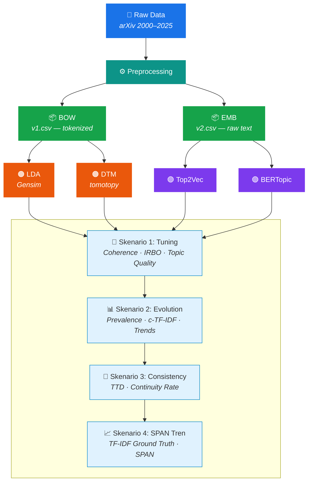

# Topic Modeling Thesis Project

A thesis research project comparing four topic modeling methods (LDA, Top2Vec, DTM, BERTopic) for temporal analysis of arXiv research papers (2000–2025) across Computer Science, Mathematics, and Physics.

## Architecture



## Project Structure

```
├── data/
│   ├── preprocess/{subject}/         # Preprocessed data per subject (cs, math, physics)
│   │   ├── bow/v1.csv                # Bag-of-words (tokenized) — for LDA, DTM
│   │   └── emb/v2.csv                # Raw text — for Top2Vec, BERTopic
│   └── raw/                          # Raw dataset files
│
├── embedding/{subject}/              # Pre-computed sentence embeddings
│
├── models/{model}/                   # Trained model files
│   ├── tuning/{subject}/             # Tuning experiment models
│   └── modeling/{subject}/           # Final models
│
├── notebooks/
│   ├── eda/                          # Exploratory Data Analysis & wordclouds
│   ├── preprocessing/                # Data preprocessing notebooks
│   └── models/{model}/               # Per-model experiment notebooks
│       ├── tuning/                   # Skenario 1: Hyperparameter tuning
│       │   └── tuning.ipynb
│       ├── temporal/                 # Skenario 2: Temporal topic analysis
│       │   └── temporal_topics.ipynb #   Prevalence, c-TF-IDF, trends (linregress)
│       ├── consistency/              # Skenario 3: Structural consistency
│       │   ├── topic_term_drift.ipynb#   TTD: endpoint, trajectory, YoY drift
│       │   └── continuity_rate.ipynb #   Continuity: stable/merge/disappear/new
│       └── tren/                     # Skenario 4: Keyword trend evaluation
│           └── keyword_trend.ipynb   #   TF-IDF ground truth + SPAN analysis
│
├── results/{model}/                  # Output CSVs per model
│   ├── tuning/{subject}/             # Tuning results
│   ├── temporal/{subject}/           # Temporal analysis results
│   │   ├── topic_word_evolution.csv  #   Topic words per year
│   │   ├── per_year_metrics.csv      #   Coherence, diversity per year
│   │   └── topic_trends.csv          #   Growing/stable/declining topics
│   ├── consistency/{subject}/        # Structural consistency results
│   │   ├── ttd_endpoint.csv          #   First→last year drift
│   │   ├── ttd_yoy_avg.csv           #   Year-over-year drift
│   │   ├── continuity_transitions.csv#   Per-topic continuity classification
│   │   ├── continuity_merges.csv     #   Merge group details
│   │   └── continuity_new_topics.csv #   Newly emerged topics
│   └── tren/{subject}/               # Keyword trend results
│       ├── ground_truth_keywords.csv #   TF-IDF classified keywords
│       ├── keyword_span.csv          #   SPAN per keyword
│       └── keyword_span_summary.csv  #   Aggregated SPAN stats
│
├── journal/                          # Research journal/notes
├── bin/                              # Utility scripts
├── archive/                          # Archived old code
├── pyproject.toml                    # Dependencies (uv) — BERTopic, Top2Vec, LDA
└── requirement.txt                   # Dependencies (pip) — DTM (tomotopy)
```

**Models**: `{model}` = `lda` | `top2vec` | `dtm` | `bertopic`
**Subjects**: `{subject}` = `cs` | `math` | `physics`

## Experiment Scenarios

| Scenario | Folder | Description |
|----------|--------|-------------|
| **1. Tuning** | `tuning/` | Hyperparameter optimization (coherence, IRBO, topic quality) |
| **2. Temporal** | `temporal/` | Topic prevalence, c-TF-IDF evolution, trend detection (linregress) |
| **3. Consistency** | `consistency/` | Topic Term Drift (TTD) + Continuity Rate (best-match) |
| **4. Keyword Trends** | `tren/` | TF-IDF ground truth keywords + SPAN analysis |

## Tech Stack

- Python 3.13+ (main) / Python 3.11 (DTM)
- BERTopic, Top2Vec, LDA (Gensim), DTM (tomotopy)
- Sentence Transformers, PyTorch
- scikit-learn, scipy, pandas, numpy

## Setup

This project uses **two separate environments**:

### Environment 1: uv (for BERTopic, Top2Vec, LDA)
Uses `pyproject.toml` + `uv.lock`

```bash
curl -LsSf https://astral.sh/uv/install.sh | sh
uv sync
```

### Environment 2: pip (for DTM)
Uses `requirement.txt` — requires Python 3.11 for tomotopy

```bash
python3.11 -m venv .venv-tomotopy
source .venv-tomotopy/bin/activate
pip install -r requirement.txt
```